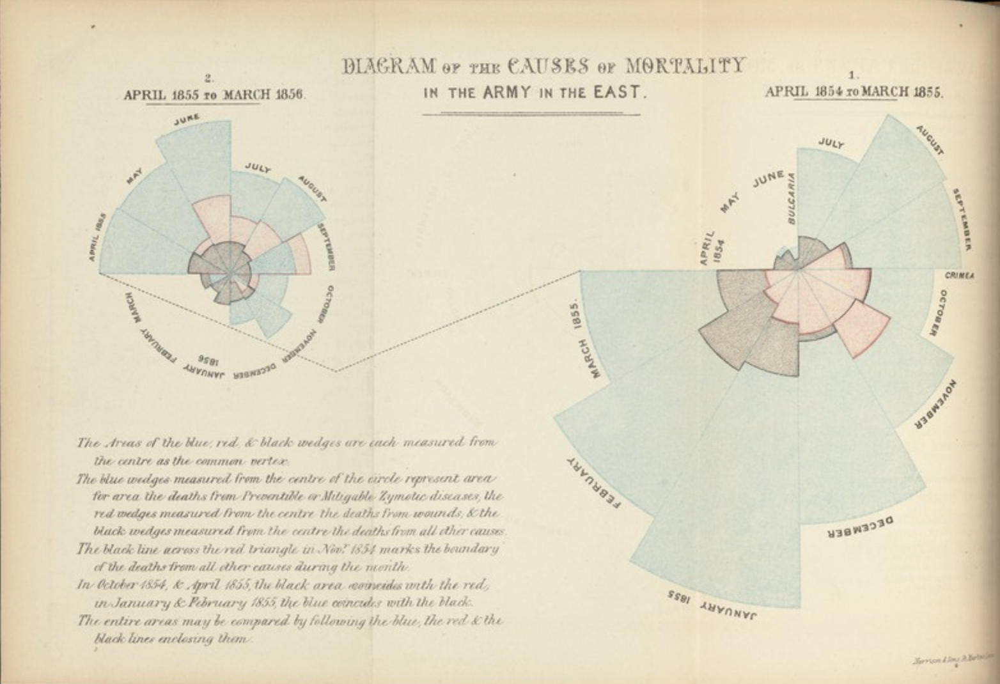
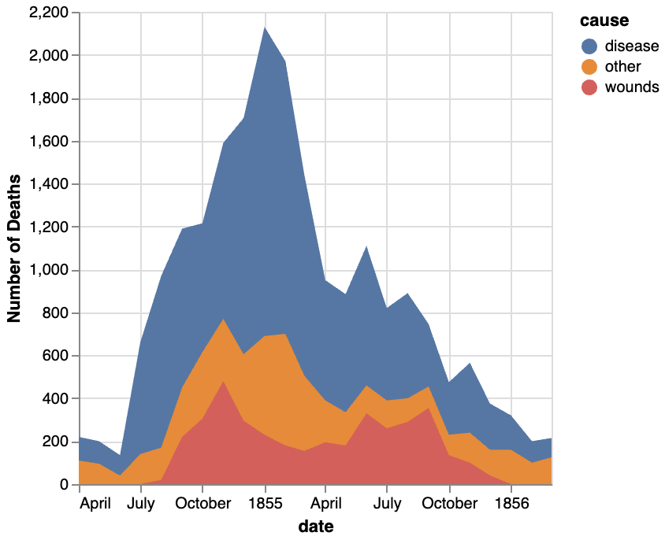
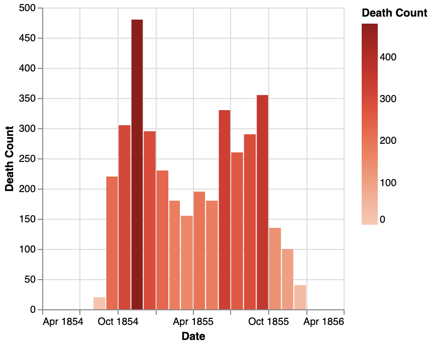
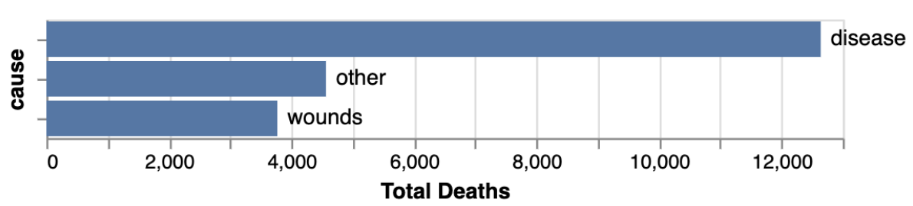
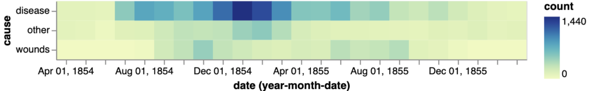

# 🩺 **Visualizing Deaths in the Crimean War** 📊


This project explores the causes of death during the Crimean War using the **Crimea dataset** from the `vega_datasets` library. 


---

## ✨ **Historical Context**

During the Crimean War (1853–1856), deaths were alarmingly high, not due to battle wounds but largely from diseases caused by poor sanitation. 

Enter **Florence Nightingale**, a pioneering statistician and nurse. Her groundbreaking work on sanitation revealed how improved hygiene and proper waste management drastically reduced death rates in war hospitals. Using her famous "Rose Diagram" (an early form of a pie chart), she illustrated the importance of sanitation in saving lives.

This project is inspired by her revolutionary use of data to drive meaningful change.

<table align="center">
  <tr>
    <td align="center">
      
      <br>
      <em>Florence Nightingale</em>
    </td>
    <td align="center">
      
      <br>
      <em>Rose Diagram</em>
    </td>
  </tr>
</table>

<br>

---


## 🚀 **Getting Started**

### **Installation**

To run the visualizations, install the required libraries:
```bash
pip install altair pandas vega_datasets
```

<br>

---


## 📂 **Dataset** 
The dataset includes:

- **Date:** The time period of recorded deaths.
- **Cause:** The category of death (wounds, disease, or other causes).
- **Count:** The number of deaths in each category.
<br>

---

## 🎨 **Visualizations**

1. **Stacked Area Chart:** Causes of Death
   
   

3. **Gradient Bar Chart:** Deaths by Cause

   

5. **Horizontal Bar Chart w/ Labels:** Deaths by Cause
   
   

6. **Heatmap:** Death Intensity Over Time

   

 <br>
 
---

## 💻 **Technologies and Tools**
- **Altair:** For creating interactive, declarative visualizations.
- **Vega Datasets:** A collection of datasets for experimentation and learning.
- **Pandas:** For data manipulation and transformation.

   
